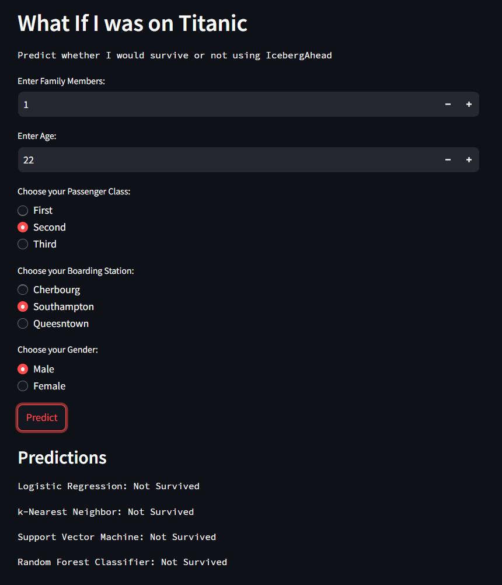
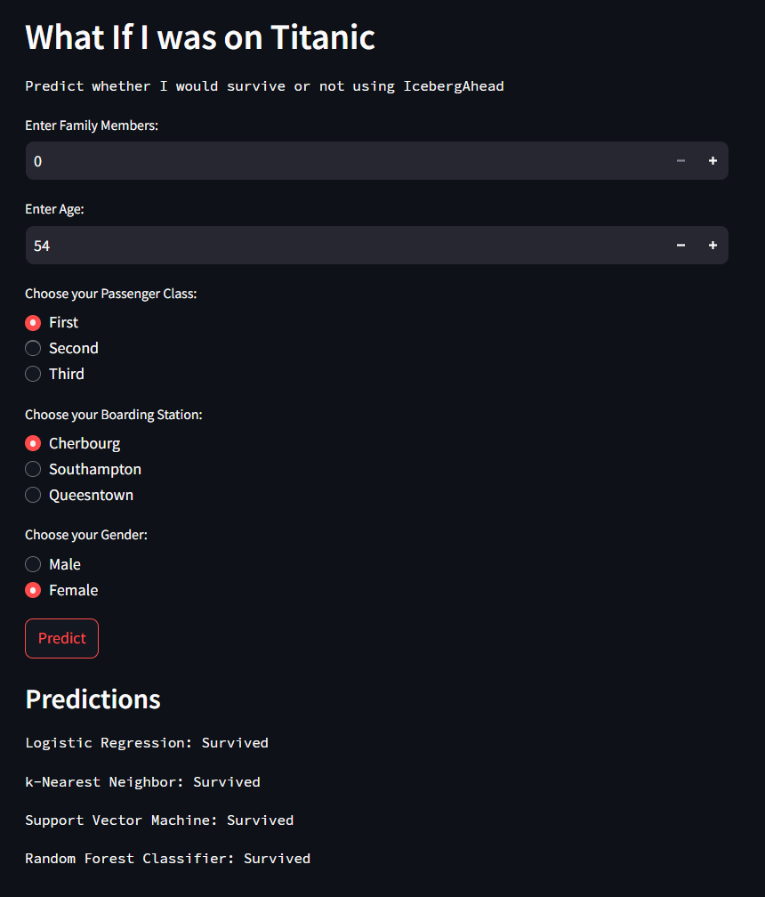

Disclaimer: ```This project uses the Titanic dataset for educational and demonstration purposes. The predictions are intended solely for learning machine learning concepts.```


Screenshots:



----------------------------------------------------



----------------------------------------------------


<h4> Purpose of this project: </h4> 
The purpose of this project was to create a predictive model that can predict the likelihood of survival if a person was on the Titanic.


### Flow of this project

1. Dataset: ```Titanic``` dataset from ```Kaggle```.

2. Combined columns ```SibSp``` and ```Parch``` into ```Family```.

3. Dropped columns ```Passenger ID```, ```Name```, ```Ticket```, ```Fare```, ```Cabin```.

4. Used ```One Hot Encoder``` on ```Embarked``` & ```Sex``` feature/column.

5. Applied ```Standardization``` on ```Age```.

6. Created new dataset ```df_new``` and copied all changed values to it.

7. Now handled missing values in ```Age``` column using ```Simple Imputer```.

8. Split the dataset into training and testing dataset using ```train_test_split``` .

6. Applied ```Logistic Regression```, ```k-Nearest Neighbor```, ```Support Vector Machine``` & ```Random Rainforest Classifier``` algorithms on training dataset.

7. Used testing dataset to ```predict``` the outcome for all the algorithms.

8. Calculated accuracy using ```accuracy_score```  which was ```1.0``` for all the algorithms except kNN, which had the accuracy around ```0.95```.

9. Exported all the models using ```pickle```

10. Used these models in ```app.py``` to integrate it into the UI which was made using ```streamlit```.
